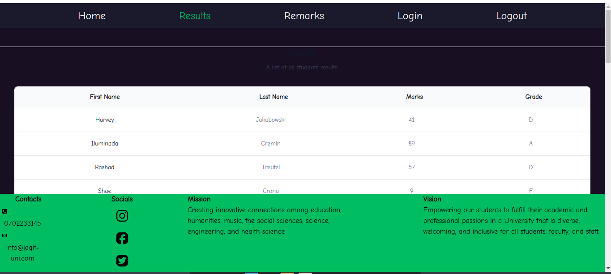
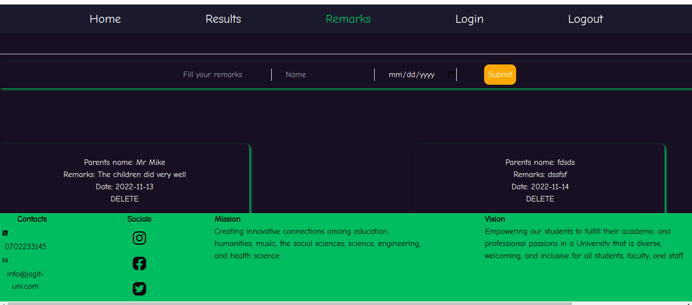
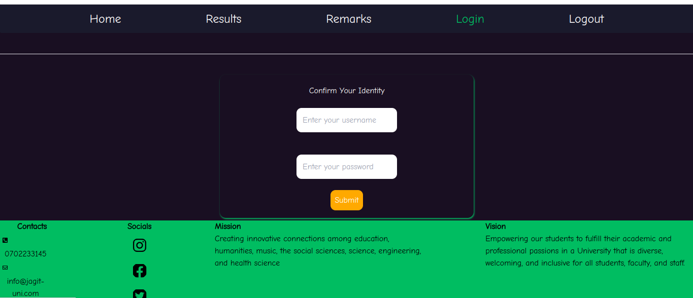
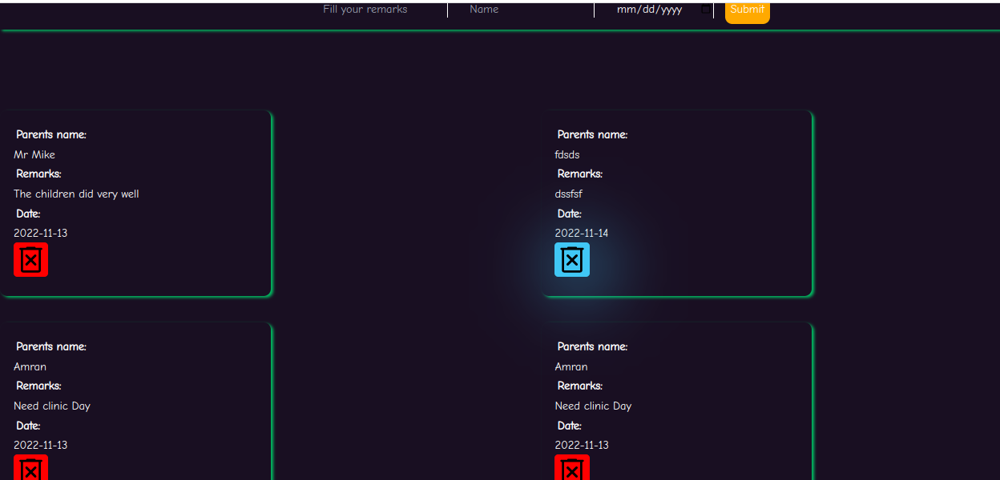

# About The Project:

            End of Phase 3 group Project Assignment

## Project Name

            JAGIT UNIVERSITY PORTAL

## Authors:

    Grace Njuguna       |   grace.njuguna@student.moringaschool.com
    Joy Chemutai        |   joy.chemutai@student.moringaschool.com
    Amran Abdikadir     |   amran.abdikadir@student.moringaschool.com
    Timothy Kibet       |   timothy.kibet@student.moringaschool.com
    Ian Mike Kaibi      |   ian.kaibi@student.moringaschool.com

## Table of Contents

- [Description](#description)
- [Requirements](#requirements)
- [Program Setup](#program-setup)
- [Live Link](#live-link-to-project)
- [Project Images](#project-images)
- [License](#license-information)

## Description
\
Results Portal is an application written in both React Js and Ruby progrmamming languages.\
The application acts a link between parents, teachers and students in terms of\
their performance in school by allowing users of the system to access grades and give remarks. \

You can also view this project by clicking on the live link provided [here](#live-link-to-project).

## Requirements
A computer with the following:
- Ruby version 2.7 or above
- Node JS version 16 or greater
- Visual studio code editor with the following installed:
 1. SQLite extension support
 2. Code Runner extension support
 3. React Snippets extension support

* A working internet connection.

## Program Setup
There are two repositories available for this project. One holds the front-end part and the other holds the backend part.
1. Clone both repositories to your computer in one folder:

Front-End in React: [Click Here](git@github.com:Bit-Bytes-Bits/results-portal.git)  

Backend in ruby: [Click Here](git@github.com:Bit-Bytes-Bits/results-portal-backend.git)

2. Open the root of the folder on your visual studio code.

3. Navigate to the backend directory, and execute ```bundle install```
and this command will install all the necessary gems required for the program to execute

4. Run ```rake server ``` and this will deploy the backend to the local host

5. Navigate to the front end folder, run ```npm install``` followed by ```npm start``` and the project will launch on your browser.


## Live Link To Project:  

[Click here](https://genuine-custard-3801cb.netlify.app/)


## Project Images
Results Page
  

Remarks Page
  

Login Page
 

Delete Action

## License Information

The MIT License (MIT)
Copyright © 2022 [Timothy Kibet](https://github.com/timbett), [Grace Njuguna](https://github.com/gracelaura), [Joy Chemutai](https://github.com/joymush), [Amran Abdikadir](https://github.com/amran04) and [Ian Mike Kaibi](https://github.com/Bit-Bytes-Bits)

Permission is hereby granted, free of charge, to any person obtaining a copy
of this software and associated documentation files (the "Software"), to deal
in the Software without restriction, including without limitation the rights
to use, copy, modify, merge, publish, distribute, sublicense, and/or sell
copies of the Software, and to permit persons to whom the Software is
furnished to do so, subject to the following conditions:

The above copyright notice and this permission notice shall be included in all
copies or substantial portions of the Software.

THE SOFTWARE IS PROVIDED "AS IS", WITHOUT WARRANTY OF ANY KIND, EXPRESS OR
IMPLIED, INCLUDING BUT NOT LIMITED TO THE WARRANTIES OF MERCHANTABILITY,
FITNESS FOR A PARTICULAR PURPOSE AND NONINFRINGEMENT. IN NO EVENT SHALL THE
AUTHORS OR COPYRIGHT HOLDERS BE LIABLE FOR ANY CLAIM, DAMAGES OR OTHER
LIABILITY, WHETHER IN AN ACTION OF CONTRACT, TORT OR OTHERWISE, ARISING FROM,
OUT OF OR IN CONNECTION WITH THE SOFTWARE OR THE USE OR OTHER DEALINGS IN THE
SOFTWARE.
